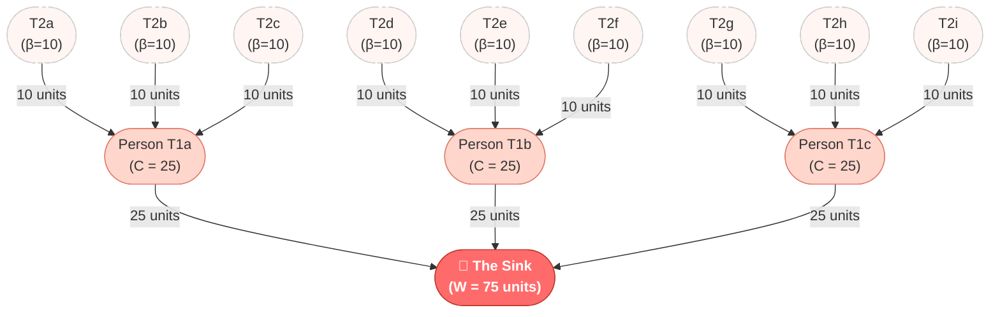

# Emotional Supply Chains

*Or: why the person you're ignoring is busy ignoring someone else, and the math behind why that's everyone's problem.*

  

---



---

## Why does this exist?

You text them back in 3 minutes. They reply in 3 days — if you're lucky, if Mercury isn't in retrograde, if you used the right amount of punctuation (turns out a period is "aggressive" now, which is genuinely insane). You eventually realize they're texting *someone else* back in 3 minutes. That someone is texting *their* someone back in 3 minutes. The chain goes on. Nobody is happy except the person at the top, who is simply existing and collecting.

This is not a coincidence. It's a supply chain. And like any supply chain, it has nodes, pass-through rates, and a structural beneficiary that the rest of the system subsidizes without knowing it.

This paper did not need to exist. It exists anyway. **The math is real.**

---

## Who This Is For

This is for anyone who has ever been busy being needed by someone who was busy needing someone else. Which is, with great mathematical certainty, almost everyone. You don't have to be heartbroken to be in this system — you just have to be human, which means you were enrolled in it sometime around adolescence, without a syllabus, without a map, and without anyone explaining that your emotional labor was about to become someone else's working capital.

We pour energy into systems that structurally cannot return it — not because we are foolish, but because *effort equals reward* is the single most reliable rule in every other domain of life. You study, you learn. You work, you earn. You plant, you harvest. Except here, in this one domain, the graph is directed. The edges don't run both ways. And nobody mentioned that.

The deeper lesson — the one this paper won't say out loud but that lives in the math — is that the middle tiers aren't victims of someone's malice. They're victims of a structure. The Sink doesn't withhold reciprocity out of cruelty; the Sink is simply the terminus of a flow that was always pointing that way. You cannot guilt a river into running uphill. You cannot negotiate with topology.

So who should read this? The person who has been someone's safe option while being no one's first choice. The person who mistakes their tolerance for loyalty, their availability for devotion, their consistency for a relationship. The person who has spent considerable energy being deeply, quietly, productively useful to someone who has spent zero energy wondering why. This model will not fix any of that — but it will *name* it. And naming a structure is the first, most radical act of freedom available to you. Because once you can see the graph, you can ask the only question that actually matters:

*Is this the node I want to be?*

---

## The Short Version (No Equations, I Promise)

Think of affection as currency. When you have a crush on someone, you freely transfer that currency to them — in the form of quick replies, unsolicited "you've got this" texts, and listening to their entire situation with Person X for the fourth time this month.

The person receiving all this? They're using it as fuel. The confidence you're handing them goes straight into their pursuit of *their* crush — who is doing the same thing to someone above them.

By the time all that emotional labor reaches the top of the chain, **one person has accumulated the combined output of an entire social pyramid** while doing nothing except existing in a way that people find compelling. Taylor Swift has released eleven studio albums about this. We chose to write a paper.

---

## The Worked Example

Same situation, but with numbers:

| Tier | Who they are | How many | Each person inputs | Keeps (ego repair) | Passes up |
|---|---|---|---|---|---|
| Tier 2 | The Base | 9 | **10 units** | 10 units | 10 units |
| Tier 1 | The Middlemen | 3 | **25 units** | 10 units | 25 units |
| Tier 0 | The Sink | 1 | *receives everything* | **75 units** | nothing |

Nine people each put in 10 units of effort. One person collects 75. The nine people are now emotionally bankrupt and wondering why they got left on read. The three middlemen feel *validated enough* to keep trying. The Sink is not wondering anything. The Sink simply is.

That's a **7.5× leverage ratio** off a single base-tier person's effort. Most hedge funds don't do that well.

---

## What Kind of Ecosystem Are You In?

The model has a critical parameter: **γm** — the pass-through rate (how much received validation someone uses to pursue *their* crush) times the branching factor (how many admirers each person has). This number decides everything.

| γm value | Regime | What it means in practice |
|---|---|---|
| **< 1** | Bounded | The Sink has a ceiling. The pyramid collapses under its own indifference. There is, mathematically, hope. |
| **= 1** | Linear | Things are getting worse at a steady, predictable rate. You could set your watch to it. |
| **> 1** | Exponential | *The Friendzone Asymptote.* The Sink's ego grows without bound. This is the interesting case. Also the bad one. |

The default worked example runs at γm = 1.5 (right in the exponential regime). Because of course it does.

---

## The Part That Actually Stings

Here's a result from the model that deserves a moment of silence:

**Every single person in the chain — regardless of how many admirers they have below them — ends up with a net loss exactly equal to their own baseline energy.** The Tier 1 middlemen, the ones with *three devoted admirers* each, still net out at exactly –10 units. Having a downline doesn't help you. It just makes you slightly more confident while you drain.

Formally: $D(u) = \beta_u$ for all $u \neq S$.

The pyramid doesn't enrich the middle. It just makes the middle *feel* like they're getting somewhere.

---

<details>
<summary><b>Show me the actual math (I'm ready, I have a whiteboard)</b></summary>

### The Model

Let the social ecosystem be a directed graph $G = (V, E)$, where $V$ is individuals and a directed edge $(u, v) \in E$ means $u$ is romantically invested in $v$. Edge weight $C(u, v)$ is emotional capital transferred per week.

In a pure unrequited structure, $G$ forms a directed tree (an arborescence) converging on a single root $S$ — the Sink. Nodes are assigned to tiers by their path distance to $S$.

**Recursive investment function:**

$$C(u) = \beta_u + \gamma \sum_{w \in N_{in}(u)} C(w)$$

**Where:**
- $\beta_u$ — baseline emotional energy generated autonomously by $u$
- $N_{in}(u)$ — $u$'s admirers (the "downline")
- $\gamma \in [0, 1]$ — the **emotional pass-through rate**: how much incoming validation $u$ weaponizes to pursue their own crush

**The deficit identity** (the result that stings):

$$D(u) = C(u) - (1 - \gamma)\sum_{w \in N_{in}(u)} C(w) = \beta_u$$

Every non-Sink node nets out at their own baseline, always.

**The Sink's accumulated wealth:**

$$W(S) = \sum_{v \in N_{in}(S)} C(v)$$

**Closed form** (symmetric pyramid, uniform $\beta$, branching factor $m$, $K$ total tiers):

$$W(S) = \beta \cdot m \left[ \frac{(\gamma m)^{K-1} - 1}{\gamma m - 1} \right]$$

> **Note:** The exponent is $K-1$, not $K$. The original paper had a notational inconsistency here. With $K$ defined as total tiers including the Sink (so $K=3$ for the worked example), the exponent must be $K-1$ to recover the correct value of 75. See `REPORT.md` §3 for the full derivation.

**Worked example verification:**

$$W(S) = 10 \cdot 3 \cdot \frac{(0.5 \times 3)^{3-1} - 1}{0.5 \times 3 - 1} = 30 \cdot \frac{(1.5)^2 - 1}{0.5} = 30 \cdot \frac{1.25}{0.5} = 30 \cdot 2.5 = 75 \checkmark$$

</details>

---

## Honest Limitations

Look, this model makes some assumptions. Two worth naming:

- **It assumes a closed, hierarchical tree.** Real social networks have cycles (people who actually like each other back — yes, this is a thing, no, the model doesn't cover it). The arborescence is a useful fiction, not a field guide.

- **There's no exit dynamic.** The model assumes everyone stays in the chain indefinitely with a constant γ. In reality, people eventually give up, get a dog, and start a podcast about healing. That's not in the equations yet.

These are features of the *model*, not bugs in the *people*.

---

## Conclusion

> *"The only mathematically sound strategy is to be the founder (the Sink) or to refuse to recruit."*

Let's be honest about what both of those actually mean.

**To be the Sink** is not a strategy you can execute. You cannot study for it, optimize into it, or arrive there through effort — because the Sink's position is entirely determined by being wanted by people who are wanted by people. It's structural, not personal. You either occupy that node or you don't, and the uncomfortable truth is that trying harder to become it is precisely the behavior that keeps you in Tier 2. The Sink doesn't pursue. The Sink is pursued. Any action you take to close that gap is, by definition, the action of someone who is not the Sink. The Sink is not a goal. It is a fact of the graph.

And here is the part nobody says: being the Sink is not a victory. It is the most validated and the least connected position in the entire structure. The Sink accumulates everything and reciprocates nothing — which means the Sink has no one. Only admirers. Those are not the same thing. Winning the pyramid means standing alone at the top of it, full of borrowed confidence, surrounded by people who are projecting something onto you that you never asked for and cannot return. The math calls this wealth. Most humans would call it loneliness with better lighting.

**To refuse to recruit** is the only option that is actually within your control — and it is genuinely harder than it sounds. It means not using the affection someone gives you as fuel to pursue someone who won't give it back. It means not letting one person's devotion become another person's ego-supply. It means closing the loop yourself, instead of passing the deficit downward. In the model, this sets your upward pass-through rate to zero. In life, it means either reciprocating honestly or stepping out of the chain entirely — not leaving people invested in a return that the structure was never designed to deliver.

The Stoics called this *prohairesis* — the one faculty that remains entirely yours: the choice of where your effort goes and why. The model shows that everything except your own baseline energy $\beta$ is structurally outside your control. The person above you doesn't respond because the graph routes that way, not because you said the wrong thing. What *is* yours is the direction of your own edge. That is the only variable in this entire system you were ever actually holding.

The pyramid doesn't ask for your consent. It doesn't need it. It runs on the same fuel as every other supply chain: the quiet, habitual assumption that input will eventually produce output. The only way to stop subsidizing it is to see it first — and then decide, deliberately, that you would rather be someone's answer than everyone's question.

&nbsp;

---

## Repo

```
paper/                   ← original scans (4 pages, Farid Nahadi, May 2026)
REPORT.md                ← full paper text + independent math review + errata
IMPLEMENTATION_GUIDE.md  ← build plan for the interactive simulator
README.md                ← you are here
```

**Author:** Farid Nahadi  
**Reviewed by:** someone with too much free time and a working knowledge of geometric series
